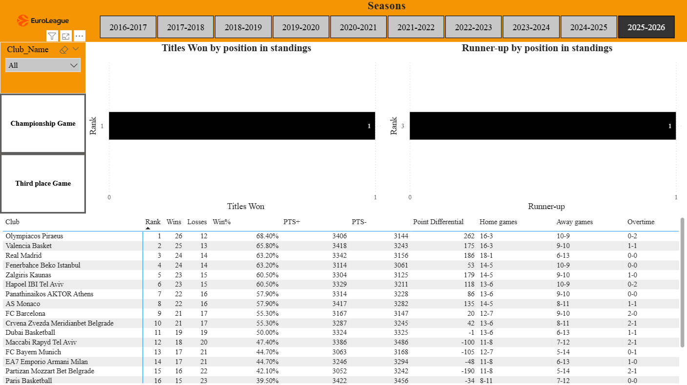
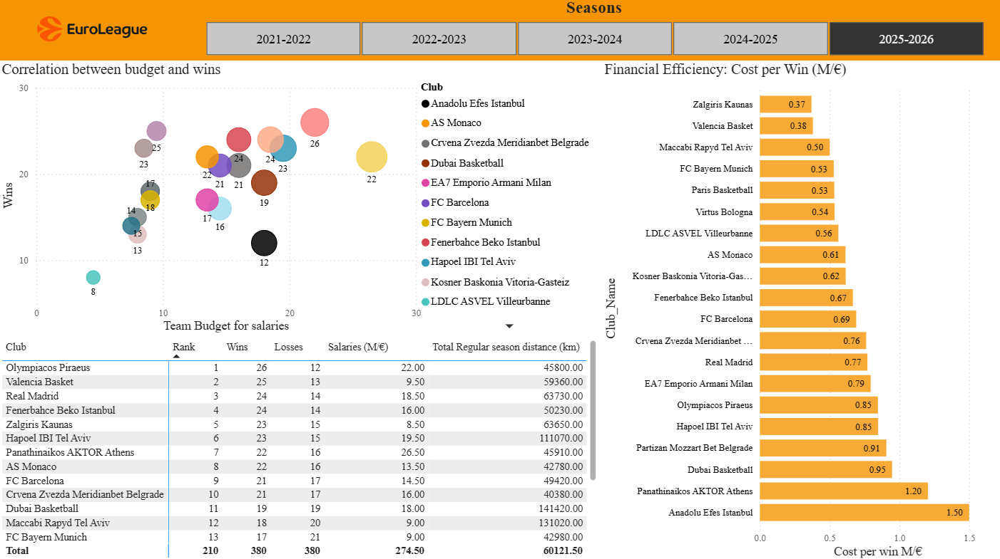
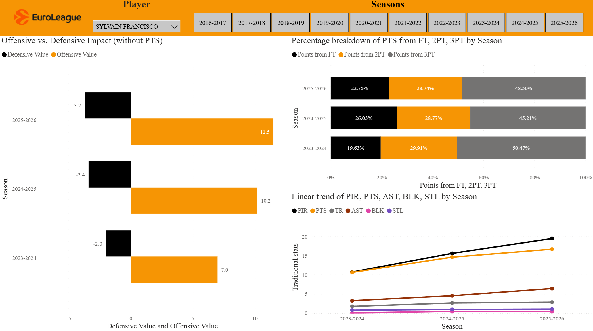
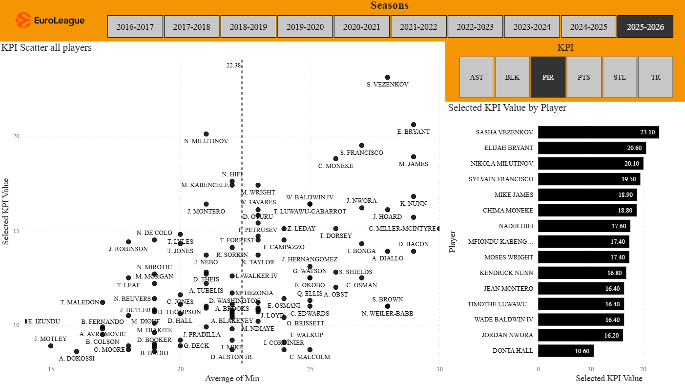

# 🏀 EuroLeague Basketball Analytics Report (2016–2026)

> An interactive Power BI Report analyzing **Last 10 seasons of EuroLeague Basketball since new format was introduced** (2016–17 to 2025–26), covering team standings, player performance, Final Four history, travel impact, and budget efficiency.

***

## 📌 Project Overview

This project was built as part of a **data analytics portfolio** to demonstrate skills in data modeling, DAX, Power Query, and interactive dashboard design using real sports data.

The dashboard answers key questions such as:
- What are the tendencies between regular season rank and playoff performance?
- Does a higher budget guarantee more wins?
- Which teams travel the most — and does it affect performance?
- Who are the most efficient players based on different KPI's?
- Which teams dominate the modern EuroLeague?

***

## 📊 Report Pages

### 1. 🏆 Regular season standings and playoffs
- Season-by-season regular season standings for all EuroLeague teams
- Win/Loss records, home vs. away performance, overtimes 
- Interactive season slicer for year-by-year comparison
- Final Four: clustered bar charts showcasing which teams according to regular season ranking most often make it to the final stage of the tournament?

### 2. 💰 Budgets & Travel
- Scatter chart: **Budget vs. Wins** — visual league context for each season
- Clustered bar chart: **Cost Per Win** metric — custom DAX measure ranking team financial efficiency
- Matrix: Combining travel distance rankings per season, budget and team ranking comparison

### 3. 👤 Player Stats
- Clustered bar chart: **Offensive vs. Defensive Player Impact** - custom DAX measures evaluating players impact on the court
- Stacked bar chart: **Percentage breakdown** answering the question - where each player makes his points from? (FT, 2PT, 3PT)
- Line Chart: Linear measure showcasing player's statistical graph change over seasons
- Interactive season slicer for year-by-year comparison

### 4. 👤 Player Stats inside of league context
- Interactive KPI slicer for statistical measure comparison
- Scatter chart: **Minutes played vs. KPI's (PIR,AST,TR,BLK,STL)**
- Average reference lines to identify elite vs. below-average players
- Drillthrough page per player showing individual KPI cards
- Interactive season slicer for year-by-year comparison
- Top 15 players by each KPI value per season


***


## 🗂️ Data Sources

| Dataset | Source | Seasons Covered | Additional Info |
|---|---|---|---|
| Team Standings | [EuroLeagueBasketball.net](https://www.euroleaguebasketball.net) | 2016–17 to 2025–26 |
| Player Statistics | [EuroLeagueBasketball.net](https://www.euroleaguebasketball.net) | 2016–17 to 2025–26 |
| Team Budgets | Retrieved from Basketnews.com articles for premium subscribers | Some of the seasons | ⚠️ Not included in repo |
| Travel Distances | Retrieved from Basketnews.com articles for premium subscribers | Some of the seasons | ⚠️ Not included in repo |
| Final Four History | [EuroLeagueBasketball.net](https://www.euroleaguebasketball.net) | 2016–17 to 2025–26 |

Data is stored and refreshed via **SharePoint** folder integration using Power Query.

***

## 🛠️ Technical Implementation

### Data Model
- Galaxy Schema (Fact Constellation) — 6 fact tables sharing 2 centralized dimension tables (Clubs Dimension, Seasons Dimension), enabling cross-filtering across all report pages
- Relationships connecting all fact tables (Standings, Players, Budgets, Travel, Final Four) through shared keys
- Relationships managed to avoid many-to-many conflicts

### Power Query
- Data loaded from SharePoint folders (CSV files per season)
- Appended across 10 seasons using `Append Queries`
- Column type enforcement, null handling, name standardization applied
- Club name standardization applied (since teams are changing their names based on sponsorships)
- Travel distance data merged from separate fact table

### Key DAX Measures


-- Team efficiency: how much does each win cost?
```dax
Cost Per Win = 
DIVIDE(
    SUM(Budgets[Players/coaches salaries (net) M/€]),
    SUM(Standings[Wins])
)
```
-- Player defensive impact.
```dax
Defensive Value = (SUM('Append_stats_traditional'[DR]) + SUM('Append_stats_traditional'[BLK]) + SUM('Append_stats_traditional'[STL])) * -1
```

-- Player offensive impact (without PTS).
```dax
Offensive Value = SUM('Append_stats_traditional'[OR]) + SUM('Append_stats_traditional'[AST]) + SUM('Append_stats_traditional'[FD])
```
-- PIR calculation.
```dax
PIR All Players = 
CALCULATE(
    AVERAGE('Append_stats_traditional'[PIR]),
    REMOVEFILTERS('Append_stats_traditional'[Player])
)
```

***
## 📁 Repository Structure

```
📦 euroleague-analytics-power-bi-project
 ┣ 📂 data/
 ┃ ┣ 📂 standings/
 ┃ ┣ 📂 players_stats/
 ┃ ┗ 📂 final_four/
 ┣ 📂 screenshots/
 ┃ ┣ 🖼️ page1_standings.png
 ┃ ┣ 🖼️ page2_travel_and_budgets.png
 ┃ ┣ 🖼️ page3_players_stats.png
 ┃ ┗ 🖼️ page4_players_stats_league_context.png
 ┗ 📄 README.md
```

***

## 🖼️ Report Screenshots

| Standings | Travel and Budgets |
|---|---|
|  |  |

| Players Stats | Players Stats / League Context |
|---|---|
|  |  |
***

## 💡 Key Insights

- Teams with the **highest budgets** generally finish in the top 8, but **Cost Per Win** reveals several high-spending underperformers
- Some teams travel **significantly more** than others each season — up to 2x the league average, but it doesn't reflect on teams performance to a high extent
- The **PIR vs. Minutes scatter** clearly separates leaders from role players
- **A small number of clubs** (Real Madrid, Olympiacos, Anadolu Efes, Fenerbahçe, CSKA Moscow) dominate Final Four appearances historically
- A weird tendency that the no. 1 Club in the regular season rankings never wins the tournament. This tendency was broken this season since the no. 1 seed - Olympiacos won the Euroleague.

***

## 👤 Author

**Domas Semenauskas**
Junior Data Analyst | Kaunas, Lithuania

[[LinkedIn – Domas Semenauskas](https://www.linkedin.com/in/domas-semenauskas/)


***

## 📄 License

This project is licensed under the MIT License. Data sourced from public basketball statistics websites for educational and portfolio purposes only.
