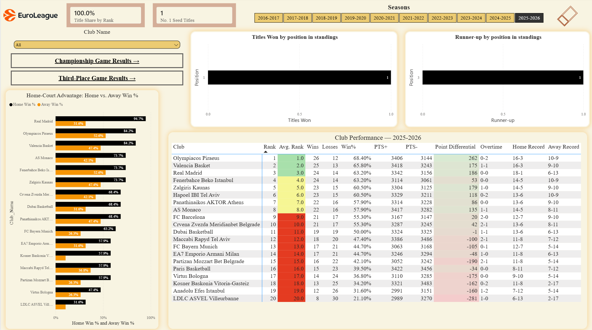
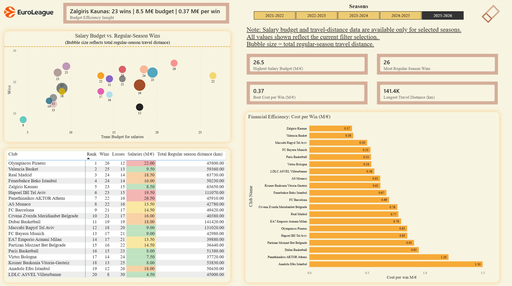
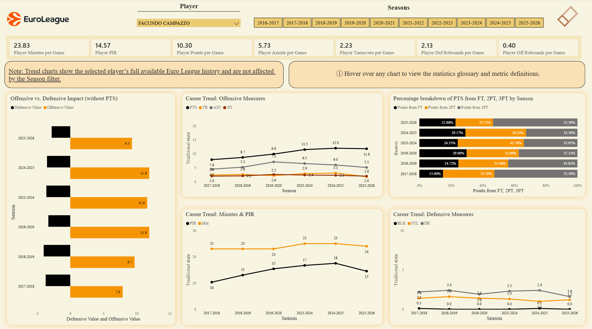
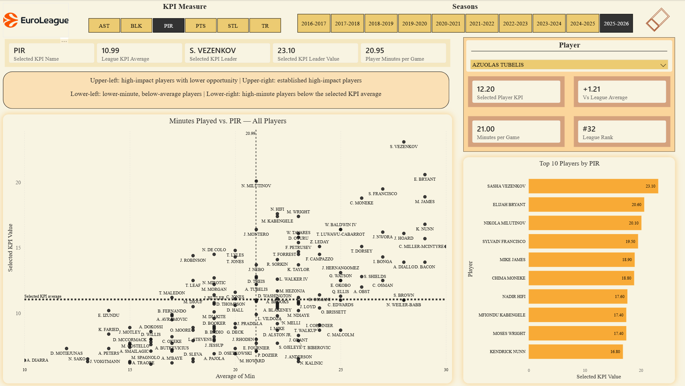
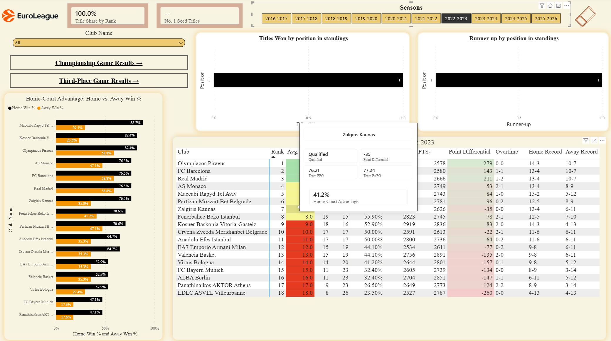
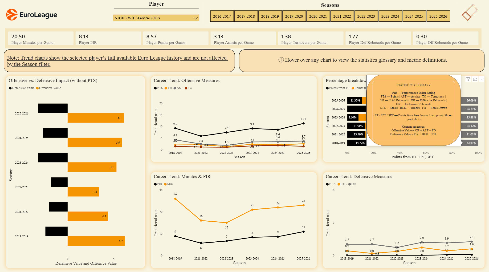
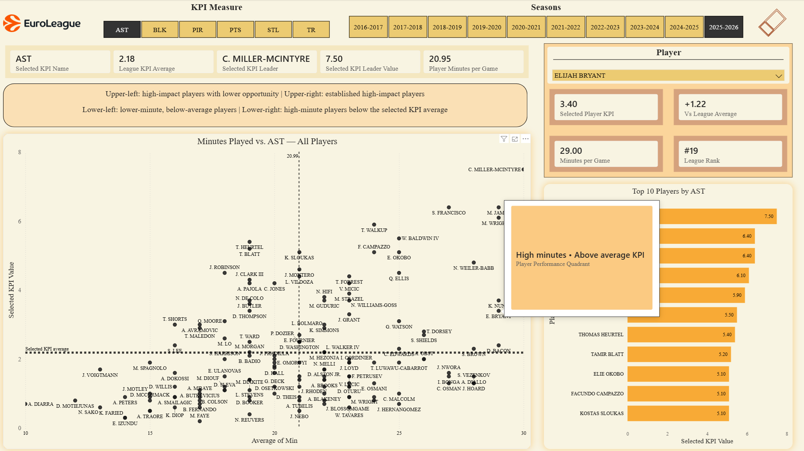

# 🏀 EuroLeague Basketball Analytics Report (2016–2026)

> An interactive Power BI report analyzing the last 10 EuroLeague Basketball seasons since the modern competition format was introduced—from 2016–17 to 2025–26. The report covers team standings, player performance, Final Four history, travel impact, and budget efficiency.

***

## 📌 Project Overview

This project was built as part of a **data analytics portfolio** to demonstrate skills in data modeling, DAX, Power Query, and interactive dashboard design using real sports data.

The dashboard answers key questions such as:

- What are the tendencies between regular-season rank and playoff performance?
- Does a higher budget guarantee more wins?
- Which teams travel the most—and does it affect performance?
- Which players lead the league across different KPIs?
- How does an individual player compare with league-average production and playing time?
- Which teams dominate the modern EuroLeague?

***

## 📊 Report Pages

### 1. 🏆 Regular Season Standings and Playoffs

- Season-by-season regular-season standings for all EuroLeague teams.
- Win/loss records, home versus away performance, and overtime context.
- Interactive season slicer for year-by-year comparison.
- Final Four clustered bar charts showing how often teams at different regular-season ranks advance to the tournament’s final stage.
- Historical perspective on title conversion, Final Four appearances, and regular-season success.

### 2. 💰 Budgets & Travel

- Scatter chart: **Budget vs. Regular-Season Wins**, providing team context for each available season.
- Bubble size represents total regular-season travel distance.
- Clustered bar chart: **Cost Per Win**, using a custom DAX measure to rank financial efficiency.
- Table combining club rank, wins, losses, salary budget, and travel distance.
- Salary-budget conditional formatting tiers for quick differentiation between:
  - Elite-budget teams: \( \geq 19 \) M€.
  - High-budget teams: 15–18.99 M€.
  - Mid-budget teams: 10–14.99 M€.
  - Lean-budget teams: \( < 10 \) M€.
- Budget and travel data are available only for selected seasons, clearly indicated within the report.

### 3. 👤 Player Stats Overview

- Clustered bar chart: **Offensive vs. Defensive Player Impact**, using custom DAX measures to evaluate player contribution.
- Stacked bar chart: player point-source breakdown across free throws, 2PT field goals, and 3PT field goals.
- Line chart showing player statistical changes across seasons.
- Interactive season slicer for historical comparison.
- Player drillthrough navigation for deeper individual analysis.

### 4. 👤 Player Stats in League Context

- Interactive KPI selector for **PIR, PTS, AST, TR, STL, and BLK**.
- Dynamic chart titles, KPI values, league benchmarks, and Top 10 rankings driven by the selected KPI.
- Scatter chart: **Minutes Played vs. Selected KPI**, comparing player opportunity with output.
- Dynamic reference lines for:
  - League-average minutes played.
  - League-average value for the selected KPI.
- Four-quadrant player classification:
  - **Upper-left:** Low minutes · Above-average KPI.
  - **Upper-right:** High minutes · Above-average KPI.
  - **Lower-left:** Low minutes · Below-average KPI.
  - **Lower-right:** High minutes · Below-average KPI.
- Dynamic Top 10 player ranking that recalculates correctly for each selected KPI and season.
- Selected-player profile panel displaying:
  - Selected KPI value.
  - Difference versus league average.
  - League rank for the selected KPI.
  - Minutes per game.
- Report-page tooltip that explains each hovered player’s performance quadrant.
- Interactive season slicer for year-by-year comparison.

***

## 🗂️ Data Sources

| Dataset | Source | Seasons Covered | Additional Info |
|---|---|---|---|
| Team Standings | [EuroLeagueBasketball.net](https://www.euroleaguebasketball.net) | 2016–17 to 2025–26 | Regular-season standings and team results |
| Player Statistics | [EuroLeagueBasketball.net](https://www.euroleaguebasketball.net) | 2016–17 to 2025–26 | Traditional player statistics and KPI inputs |
| Team Budgets | Basketnews.com premium articles | Selected seasons | ⚠️ Not included in the repository |
| Travel Distances | Basketnews.com premium articles | Selected seasons | ⚠️ Not included in the repository |
| Final Four History | [EuroLeagueBasketball.net](https://www.euroleaguebasketball.net) | 2016–17 to 2025–26 | Final Four and title history |

Data is stored and refreshed through a **SharePoint folder** integration using Power Query.

***

## 🛠️ Technical Implementation

### Data Model

- Galaxy schema / fact constellation design, with six fact tables sharing centralized **Clubs** and **Seasons** dimensions.
- Fact tables cover standings, player statistics, budgets, travel, and Final Four data.
- Shared dimensions enable consistent cross-filtering across report pages.
- Relationships are managed to avoid unnecessary many-to-many conflicts.
- A disconnected **KPI Selector** table enables dynamic player KPI analysis without altering the underlying fact-table structure.

### Power Query

- Data loaded from SharePoint folders using season-level CSV files.
- Player and standings data appended across 10 seasons with `Append Queries`.
- Column data types enforced and null values handled.
- Club-name standardization applied to account for sponsorship-related naming changes.
- Travel-distance data merged from a separate fact table.
- Player names standardized through a dedicated player-name dimension for consistent filtering and profile analysis.

### Key DAX Measures

#### Team efficiency: cost per regular-season win

```dax
Cost Per Win =
DIVIDE(
    SUM(Budgets[Players/coaches salaries (net) M/€]),
    SUM(Standings[Wins])
)
```

#### Player defensive impact

```dax
Defensive Value =
(
    SUM('Append_stats_traditional'[DR]) +
    SUM('Append_stats_traditional'[BLK]) +
    SUM('Append_stats_traditional'[STL])
) * -1
```

#### Player offensive impact, excluding points scored

```dax
Offensive Value =
SUM('Append_stats_traditional'[OR]) +
SUM('Append_stats_traditional'[AST]) +
SUM('Append_stats_traditional'[FD])
```

#### KPI selector

```dax
Selected KPI Name =
SELECTEDVALUE(
    'KPI Selector'[KPI],
    "PIR"
)
```

```dax
Selected KPI Value =
SWITCH(
    [Selected KPI Name],
    "PIR", [Player PIR],
    "PTS", [Player Points per Game],
    "AST", [Player Assists per Game],
    "TR",
        [Player Offensive Rebounds per Game] +
        [Player Defensive Rebounds per Game],
    "STL", AVERAGE('Append_stats_traditional'[ST]),
    "BLK", AVERAGE('Append_stats_traditional'[BLK])
)
```

#### Dynamic titles

```dax
KPI Scatter Title =
"Minutes Played vs. " &
[Selected KPI Name] &
" — All Players"
```

```dax
Top 10 KPI Title =
"Top 10 Players by " &
[Selected KPI Name]
```

#### League-average KPI benchmark

```dax
Selected KPI Average All Players =
AVERAGEX(
    ALLSELECTED('Append_stats_traditional'[Player]),
    [Selected KPI Value]
)
```

#### KPI leader

```dax
Selected KPI Leader =
VAR LeaderTable =
    TOPN(
        1,
        ADDCOLUMNS(
            ALLSELECTED('Append_stats_traditional'[Player]),
            "@KPIValue", [Selected KPI Value]
        ),
        [@KPIValue], DESC,
        'Append_stats_traditional'[Player], ASC
    )
RETURN
    CONCATENATEX(
        LeaderTable,
        'Append_stats_traditional'[Player],
        ", "
    )
```

#### Selected player versus league average

```dax
Selected Player vs League Average =
VAR PlayerValue =
    [Selected Player KPI]

VAR LeagueAverage =
    CALCULATE(
        [Selected KPI Average All Players],
        REMOVEFILTERS('dimension-players-names-formatted'[Player])
    )

RETURN
    IF(
        ISBLANK(PlayerValue),
        BLANK(),
        PlayerValue - LeagueAverage
    )
```

#### Player KPI rank

```dax
Selected Player KPI Rank =
VAR PlayerValue =
    [Selected Player KPI]

VAR RankValue =
    RANKX(
        ALL('dimension-players-names-formatted'[Player]),
        CALCULATE([Selected KPI Value]),
        PlayerValue,
        DESC,
        DENSE
    )

RETURN
    IF(
        ISBLANK(PlayerValue),
        BLANK(),
        RankValue
    )
```

#### Dynamic player performance quadrant

```dax
Player Performance Quadrant =
VAR PlayerMinutes =
    [Player Minutes per Game]

VAR PlayerKPI =
    [Selected KPI Value]

VAR AverageMinutes =
    CALCULATE(
        [Min All Players],
        REMOVEFILTERS('Append_stats_traditional'[Player])
    )

VAR AverageKPI =
    CALCULATE(
        [Selected KPI Average All Players],
        REMOVEFILTERS('Append_stats_traditional'[Player])
    )

RETURN
    SWITCH(
        TRUE(),
        ISBLANK(PlayerMinutes) || ISBLANK(PlayerKPI),
            BLANK(),

        PlayerMinutes < AverageMinutes &&
        PlayerKPI >= AverageKPI,
            "Low minutes -  Above average KPI",

        PlayerMinutes >= AverageMinutes &&
        PlayerKPI >= AverageKPI,
            "High minutes -  Above average KPI",

        PlayerMinutes < AverageMinutes &&
        PlayerKPI < AverageKPI,
            "Low minutes -  Below average KPI",

        PlayerMinutes >= AverageMinutes &&
        PlayerKPI < AverageKPI,
            "High minutes -  Below average KPI"
    )
```

***

## 📁 Repository Structure

```text
📦 euroleague-analytics-power-bi-project
 ┣ 📂 data/
 ┃ ┣ 📂 standings/
 ┃ ┣ 📂 players_stats/
 ┃ ┗ 📂 final_four/
 ┣ 📂 screenshots/
 ┃ ┣ 🖼️ page_1_standings_overview.png
 ┃ ┣ 🖼️ page_2_travel_and_budgets.png
 ┃ ┣ 🖼️ page_3_player_stats_overview.png
 ┃ ┣ 🖼️ page_4_player_stats_league_context.png
 ┃ ┣ 🖼️ interactivity_1.png
 ┃ ┣ 🖼️ interactivity_2.png
 ┃ ┗ 🖼️ interactivity_3.png
 ┗ 📄 README.md
```

***

## 🖼️ Report Screenshots

| Regular Season Standings | Budgets & Travel |
|---|---|
|  |  |

| Player Stats Overview | Player Stats in League Context |
|---|---|
|  |  |

### Interactivity and Analysis Features

| KPI and season interaction | Dynamic player-profile comparison | Performance-quadrant tooltip |
|---|---|---|
|  |  |  |

***

## 🛠️ Tools and Skills

### Tools Used

- **Power BI Desktop** — Used to build the interactive report, design report pages, create visuals, configure slicers, drillthrough navigation, tooltips, and dashboard interactions.
- **Power Query** — Used for data ingestion, transformation, data-type validation, appending season-level CSV files, merging travel data, handling null values, and standardizing club and player names.
- **DAX** — Used to create calculated measures for Cost Per Win, offensive and defensive player impact, dynamic KPI selection, league-average benchmarks, player rankings, dynamic titles, and performance-quadrant classification.
- **SharePoint Folder Integration** — Used as the central data-storage and refresh source for season-level CSV files imported into Power BI.
- **Devin Desktop** — Used to support web-scraping and collection of historical EuroLeague standings, player statistics, Final Four history, and other structured source data from public basketball websites.
- **CSV files** — Used as the project’s source-data format, organized by season and subject area for Power Query ingestion and model refresh.
- **GitHub** — Used to document the project, publish supporting data and screenshots, and present the final dashboard as part of a data-analytics portfolio.

### Skills Demonstrated

- Web scraping and structured sports-data collection with Devin Desktop
- Data-source assessment, data extraction, and CSV-based data management
- Data cleaning and transformation with Power Query
- Appending and combining multi-season datasets
- Data-type enforcement, null-value handling, and data-quality validation
- Club-name and player-name standardization across multiple seasons
- Relational data modeling using a galaxy-schema / fact-constellation approach
- Fact and dimension table design
- Relationship management and cross-filtering in Power BI
- DAX measure development and reusable calculation logic
- Financial-efficiency analysis using Cost Per Win
- Dynamic KPI selection with a disconnected selector table
- Dynamic titles, rankings, and league-average benchmarking
- Player-performance segmentation with quadrant analysis
- Interactive report design with slicers, drillthrough, tooltips, and conditional formatting
- Sports-performance analysis and financial-context analysis
- Dashboard storytelling, insight communication, and limitation reporting
- Portfolio documentation and project publishing with GitHub

### How the Tools Worked Together

The project began with collecting and structuring historical EuroLeague data using Devin Desktop and publicly available basketball sources. The resulting season-level CSV files were stored in SharePoint and loaded into Power BI through a SharePoint Folder connection.

Power Query was then used to combine, clean, standardize, and prepare the data for analysis. The transformed tables were organized into a galaxy-schema data model, with shared Clubs and Seasons dimensions connecting the standings, player statistics, budgets, travel, and Final Four fact tables.

DAX measures added the analytical layer of the report. They enabled Cost Per Win calculations, dynamic KPI switching, league-average comparisons, player rankings, reference lines, dynamic labels, and player-performance quadrants. Power BI report-page features—including slicers, drillthrough, tooltips, visual interactions, and conditional formatting—then turned those calculations into an interactive analytics experience.

Finally, GitHub is used to document the business questions, methodology, source limitations, DAX logic, dashboard features, and screenshots for portfolio presentation.

***

## 💡 Key Insights

- Teams with the **highest budgets** generally finish in the top eight, but the Cost Per Win measure also identifies high-spending teams with weaker financial efficiency.
- Travel requirements vary significantly across EuroLeague teams and seasons. In the available data, some teams travel close to twice as far as others, although travel distance alone does not explain team performance.
- The KPI selector makes it possible to compare distinct player roles. A player may rank highly in PIR, points, assists, rebounds, steals, or blocks while receiving very different levels of playing time.
- The Minutes vs. KPI scatterplot identifies four useful player profiles: established high-impact players, high-impact players with lower opportunity, high-minute players below the selected KPI average, and lower-minute players below the KPI benchmark.
- A small group of clubs—including Real Madrid, Olympiacos, Anadolu Efes, Fenerbahçe, and CSKA Moscow—accounts for a large share of modern EuroLeague Final Four appearances.
- Historically, the regular-season No. 1 seed often did not convert first place into the title. The 2025–26 season broke that pattern when Olympiacos, the No. 1 seed, won the EuroLeague.

***

## 👤 Author

**Domas Semenauskas**  
Junior Data Analyst | Lithuania

[LinkedIn – Domas Semenauskas](https://www.linkedin.com/in/domas-semenauskas/)

***

## 📄 License

This project is licensed under the MIT License. Data sourced from public basketball statistics websites for educational and portfolio purposes only.
